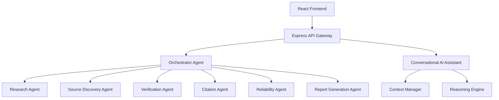

# ClaurusIQ

**Autonomous Multi-Agent Research & Fact Verification System**

> Research Smarter. Verify Faster. Trust the Evidence.

## Architecture



## Setup Instructions

### Prerequisites
- Node.js 18+
- MongoDB Atlas (or local MongoDB)

### Backend Setup
```bash
cd server
npm install
npm run dev
```

### Frontend Setup
```bash
cd client
npm install
npm run dev
```

## Environment Variables
Create `server/.env`:
```env
PORT=5000
MONGO_URI=your_mongodb_uri
JWT_SECRET=your_jwt_secret
GEMINI_API_KEY=your_gemini_key
CLIENT_URL=http://localhost:5173
```

Create `client/.env` for production deployments:
```env
VITE_API_BASE_URL=https://<your-api-domain>/api/v1
```

## API Documentation

| Endpoint | Method | Description |
|---|---|---|
| `/api/auth/register` | POST | Register a new user |
| `/api/auth/login` | POST | Login and receive JWT |
| `/api/workflow` | POST | Start a new research workflow |
| `/api/workflow/:id/stream` | GET | SSE stream for real-time progress |
| `/api/chat/message` | POST | Send a message to AI Assistant |
