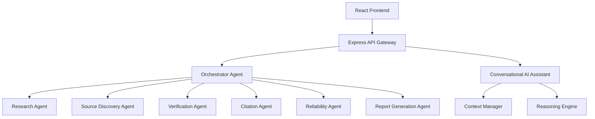

# 🚀 ClaurusIQ

> **An Autonomous Multi-Agent Research, Verification & Intelligence Platform**

ClaurusIQ is an AI-powered research platform that goes beyond traditional search engines by combining multiple intelligent AI agents with trusted research sources to deliver comprehensive, evidence-backed, and explainable research.

Instead of simply returning search results, ClaurusIQ analyzes information from multiple providers, verifies claims, evaluates source reliability, generates citations, and produces detailed research reports with transparent reasoning.
# 🌟 Features
## 🤖 Autonomous Multi-Agent AI System
- Orchestrator Agent
- Research Agent
- Source Discovery Agent
- Evidence Verification Agent
- Citation Agent
- Reliability Agent
- Executive Intelligence Agent
- Conversation Agent
- Research Explanation Engine
- 
## 🔍 Intelligent Research Engine

- Multi-source research
- Intelligent query processing
- Source aggregation
- Duplicate detection
- Smart provider routing
- Context-aware research
- Research session history
- Follow-up question support

## ✅ Evidence Verification Engine

- Automatic claim extraction
- Supporting evidence collection
- Contradicting evidence detection
- Confidence scoring
- Evidence traceability
- Transparent verification results

## 📚 Citation Engine

Supports multiple academic citation formats including:

- APA
- MLA
- IEEE
- Chicago
- Harvard
- BibTeX
- RIS

Automatically extracts:

- Authors
- DOI
- Journal
- Publisher
- Publication Date
- Volume
- Issue
- Pages


## 📊 Reliability Analysis

Every research response includes:

- Reliability Score
- Confidence Score
- Source Consensus
- Bias Analysis
- Explainability
- Transparency Report

## 📄 Document Intelligence

Upload and analyze documents including:

- PDF
- DOCX
- TXT
- Markdown
- CSV
- JSON
- PPTX
- Images
- Scanned Documents

Features include:

- OCR
- Entity Extraction
- Claim Extraction
- Document Summarization
- Knowledge Extraction
- Cross-document Analysis

## 💬 Conversational AI Assistant

- Context-aware conversations
- Multi-turn discussions
- Research continuation
- Document-aware responses
- Session memory
- Follow-up question handling

## 📑 Professional Report Generation

Generate:

- Executive Reports
- Technical Reports
- Research Reports
- Detailed Analysis Reports

Each report includes:

- Executive Summary
- Evidence
- Citations
- Reliability Analysis
- Recommendations
- References

---

## 📤 Export Support

Export research into:

- PDF
- DOCX
- Markdown
- HTML
- JSON
- CSV
- PowerPoint

---

## 🔐 Authentication & Security

- JWT Authentication
- Secure Password Hashing
- Protected Routes
- Ownership-Based Access Control
- Secure API Communication

---

# 🛠️ Tech Stack

## Frontend

- React
- Vite
- Tailwind CSS
- Framer Motion
- React Router

## Backend

- Node.js
- Express.js
- MongoDB Atlas
- JWT
- bcrypt

## AI & Research

- Google Gemini
- Tavily
- OpenAlex
- Crossref
- CORE
- arXiv
- Wikipedia
- NewsAPI

---

# 🏗️ System Workflow

```text
User Query
      │
      ▼
Orchestrator Agent
      │
      ▼
Research Agent
      │
      ▼
Multiple Research Providers
      │
      ▼
Source Aggregation
      │
      ▼
Duplicate Removal
      │
      ▼
Evidence Verification
      │
      ▼
Citation Generation
      │
      ▼
Reliability Analysis
      │
      ▼
Research Explanation Engine
      │
      ▼
Executive Intelligence
      │
      ▼
Comprehensive Research Report
```

---

# 🎯 Key Highlights

- Multi-Agent AI Architecture
- Explainable AI Responses
- Evidence-Based Research
- Automatic Citation Generation
- Reliability & Bias Analysis
- Academic Research Support
- Professional Report Generation
- Document Intelligence
- OCR Support
- Multi-Provider Research
- Context-Aware AI Conversations
- Modern Responsive Interface

---

# 📁 Project Structure

```text
ClaurusIQ/
│
├── frontend/
│   ├── components/
│   ├── pages/
│   ├── layouts/
│   ├── hooks/
│   ├── services/
│   └── assets/
│
├── backend/
│   ├── controllers/
│   ├── routes/
│   ├── middleware/
│   ├── services/
│   ├── models/
│   ├── utils/
│   ├── agents/
│   ├── engines/
│   └── providers/
│
└── docs/
```

---

# 🚀 Getting Started

### Clone the Repository

```bash
git clone https://github.com/your-username/ClaurusIQ.git
```

### Install Dependencies

Frontend

```bash
cd frontend
npm install
```

Backend

```bash
cd backend
npm install
```

### Configure Environment Variables

Create a `.env` file and configure the required API keys and database connection.

### Start the Development Server

Frontend

```bash
npm run dev
```

Backend

```bash
npm start
```

---

# 🎯 Vision

Our vision is to build an intelligent research platform that combines autonomous AI agents with trusted information sources to provide transparent, explainable, and evidence-backed knowledge.

ClaurusIQ empowers students, researchers, professionals, educators, and organizations with reliable AI-assisted research while maintaining trust through citations, verification, and explainability.

---

# 🤝 Contributing

Contributions are welcome!

If you'd like to improve ClaurusIQ, feel free to fork the repository, create a feature branch, and submit a pull request.

---

# 📄 License

This project is licensed under the **MIT License**.

---

# ⭐ Support

If you found this project useful, consider giving it a ⭐ Star on GitHub to support its development.

---

## **Research Smarter. Verify Every Claim. Trust the Evidence.**
## Architecture



